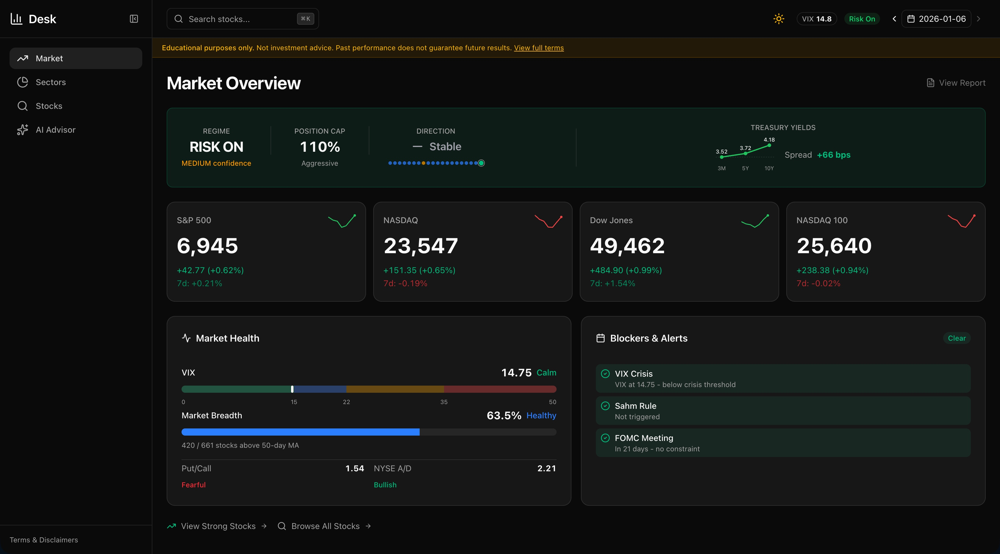
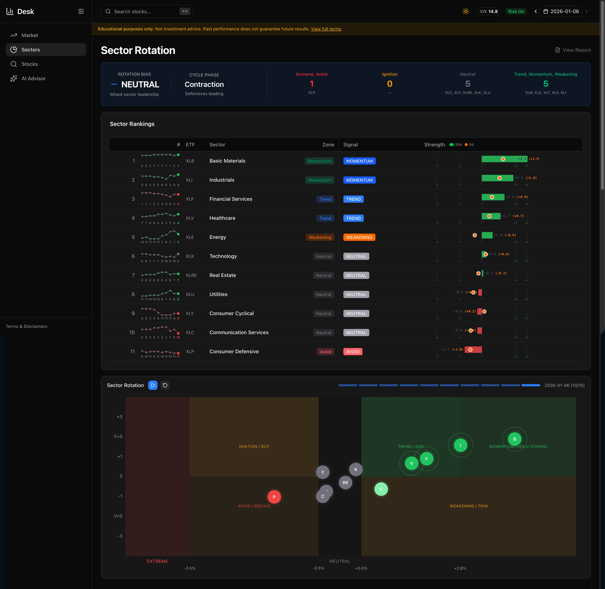
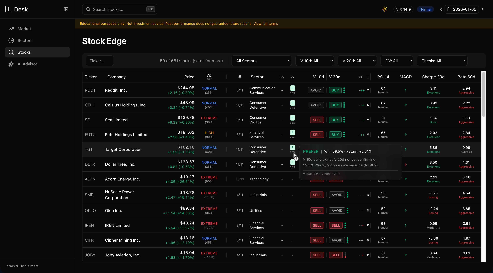
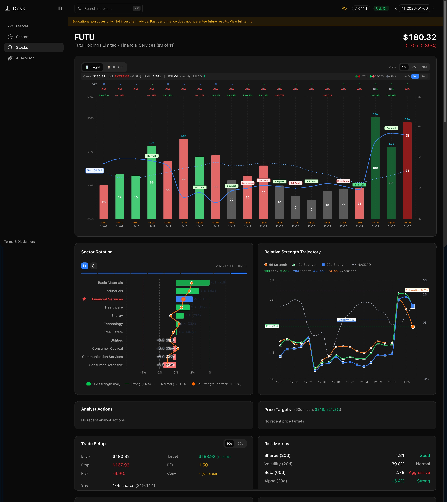
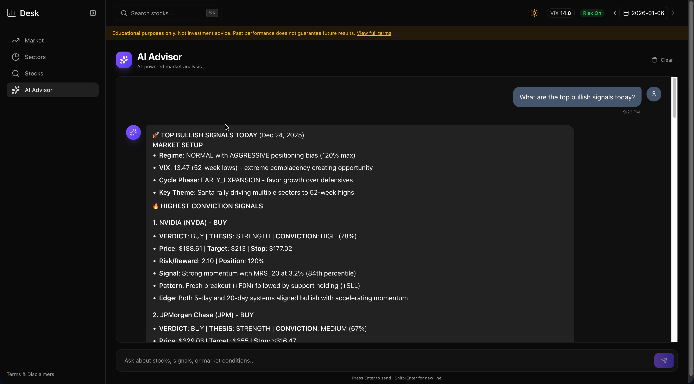

# Desk

Modern trading dashboard built with Next.js 16, React 19, and Recharts.



## Live Demo

**[desk.teea.ai](https://desk.teea.ai)**

## Features

### Market Overview
Real-time market regime analysis with VIX gauge, breadth indicators, and treasury yields.

### Sector Rotation
Interactive sector rotation map with zone classification and historical playback.



### Stock Screener
Filter stocks by signals, verdicts, and sectors with sortable columns and sparkline charts.



### Stock Detail
Candlestick charts with volume, MRS indicators, gap analysis, and pattern recognition.



### AI Advisor
Claude-powered trading assistant with multi-day context and tool integration.



## Tech Stack

| Technology | Version | Purpose |
|------------|---------|---------|
| Next.js | 16.0.10 | Framework with Turbopack |
| React | 19.2.1 | UI with React Compiler |
| Recharts | 3.5.1 | Charts and visualizations |
| shadcn/ui | latest | Component library |
| Tailwind CSS | 4.0 | Styling with OKLCH colors |
| better-sqlite3 | 12.5.0 | Direct SQLite read access |

## Getting Started

```bash
# Clone the repo
git clone https://github.com/adams-wang/desk.git
cd desk

# Install dependencies
pnpm install

# Rebuild native modules (see Troubleshooting if this fails silently)
pnpm rebuild better-sqlite3

# Set up environment
cp .env.example .env.local
# Edit .env.local with your database path

# Start dev server
pnpm dev
```

Open [http://localhost:3000](http://localhost:3000)

## Project Structure

```
src/
├── app/                    # Next.js App Router
│   ├── page.tsx           # Market Overview (home)
│   ├── market/            # Market dashboard
│   ├── stocks/            # Stock screener & detail
│   ├── sectors/           # Sector rotation
│   ├── chat/              # AI Advisor
│   └── api/               # API routes
├── components/
│   ├── charts/            # Recharts visualizations
│   ├── market/            # Market components
│   ├── sectors/           # Sector components
│   └── ui/                # shadcn components
└── lib/
    ├── db.ts              # SQLite connection
    └── queries/           # Database queries
```

## Configuration

Create `.env.local`:

```bash
DB_PATH=/path/to/your/stocks.db
CONTRACTS_PATH=/path/to/your/contracts
```

## Database Schema

The dashboard reads from a SQLite database with these key tables:

- `trading_days` - Trading calendar
- `stocks_ohlcv` - Stock price data
- `l1_contracts` - Market regime data
- `l2_sector_rankings` - Sector rotation signals
- `l3_contracts_*` - Stock verdicts

See `docs/architecture.md` for full schema documentation.

## Troubleshooting

### better-sqlite3 bindings not found

If you see "Could not locate the bindings file" after `pnpm rebuild`, rebuild manually:

```bash
cd node_modules/.pnpm/better-sqlite3@12.5.0/node_modules/better-sqlite3
npx node-gyp rebuild
```

This typically happens when Node.js version changes or switching between architectures (x86 vs arm64).

## License

MIT

## Author

adams.wangy@gmail.com
